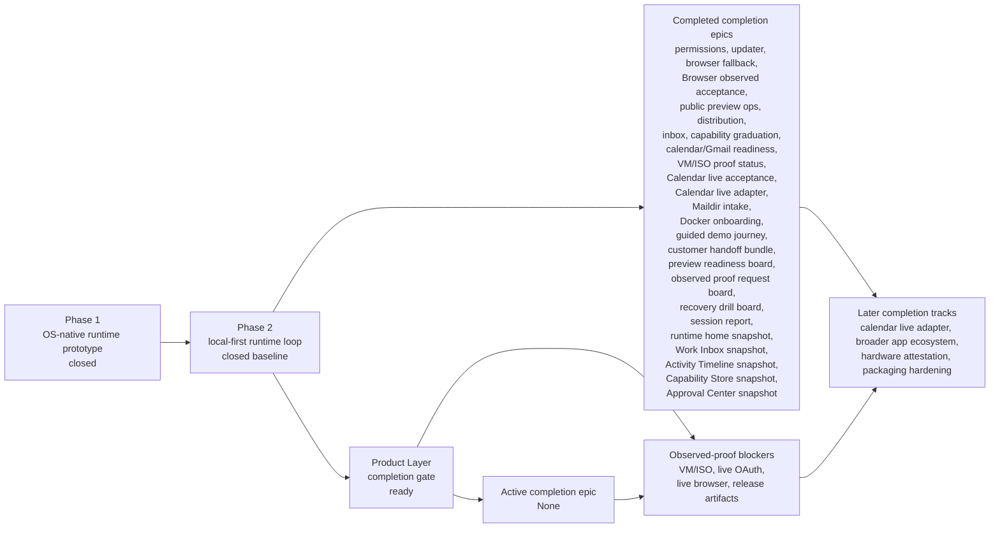

# AgentOS

[English](README.md) | [한국어](README.ko.md) | [日本語](README.ja.md) | [中文](README.zh.md)

> **Repository migration:** this is the former bootable/headless OS prototype. The primary **Personal AgentOS** project now lives at [Jongtae/agentos](https://github.com/Jongtae/agentos).

**A bootable, headless-first OS prototype with an agent-managed post-boot runtime.**

AgentOS explores what an operating system looks like when the default interface
after boot is an agent runtime instead of a traditional desktop.

It can receive a request, classify intent, run a capability, reply, and leave a
proof/activity log.

```text
TTY / Web / Telegram request
        ↓
intent dispatch
        ↓
capability execution
        ↓
reply + proof/activity log
```

This is a public prototype, not a production AI OS distribution.

## Try It

Docker is the easiest way to try the AgentOS runtime today. The bootable ISO
remains the long-term OS form factor.

```bash
git clone git@github.com:Jongtae/agentos-os-prototype.git
cd agentos-os-prototype
cp .env.example .env
docker compose up
```

Open:

```text
http://localhost:8787
```

Try prompts such as:

```text
status
hi
workspace 파일 목록 보여줘
search AgentOS roadmap and summarize it
```

## What You Should See

- Runtime status and setup state in the browser.
- Prompt routing through the AgentOS runtime.
- Human-readable activity/proof output.
- Degraded states when LLM or Telegram credentials are missing.
- No required API key for the basic local preview.

## What AgentOS Is Proving

AgentOS is not “just a bot” and not “just a Python CLI.”

The project is testing this product thesis:

> After boot, the OS should expose a managed agent runtime that can understand
> requests, coordinate tools, and show what it did.

Today that proof is available in two forms:

- **Docker preview:** fastest public way to try the runtime loop.
- **Bootable ISO:** advanced VM path for testing the OS-shaped form factor.

Docker does not prove boot ownership. The ISO path is not yet polished. Both are
kept because the runtime must be easy to try while the OS form factor matures.

## What Works Now

- `docker compose up` starts a local AgentOS runtime preview.
- The Docker preview is the default public Product Layer try path.
- `http://localhost:8787` shows status, setup state, prompt execution, and activity.
- Greeting, status, workspace, and search-style requests route through intent dispatch.
- A terminal-first operator surface exists for the VM/ISO path.
- Agent/shell modes exist in the TTY operator prototype.
- Local Ollama is the default local LLM path in the OS prototype.
- Telegram setup/reply experiments work when credentials are configured.
- Runtime proof/activity hooks write evidence under the workspace.

## Quick Paths

### Docker Runtime Preview

```bash
docker compose up
```

CLI shortcut:

```bash
docker compose run --rm agent-os --prompt "status"
docker compose run --rm agent-os --prompt "workspace 파일 목록 보여줘"
```

### Advanced VM/ISO Path

```bash
./scripts/build_latest_agentos_iso.sh
```

Then boot the generated ARM64 ISO in a VM such as UTM on Apple Silicon.

Expected flow:

```text
Boot
  -> AgentOS TTY/operator surface
  -> managed agent runtime
  -> readiness for LLM / Telegram / Web
  -> AgentOS prompt and command shortcuts
```

### Local Developer Shortcut

```bash
python3 src/main.py --doctor
python3 src/main.py --no-tui
./scripts/agentos-kernelctl phase2-run --message "status"
```

## Operator Commands

In the TTY operator prototype:

```text
/status          show runtime status
/mode agent      talk to AgentOS
/mode shell      run Linux commands directly
/setup llm       configure the LLM path
/setup telegram  configure Telegram
/power           restart/reboot/shutdown menu
% <command>      run one Linux command from agent mode
```

## Architecture

```text
Docker preview or bootable ISO
        ↓
AgentOS runtime
        ↓
TTY / Web / Telegram input
        ↓
intent dispatcher
        ↓
capabilities: status, workspace, web, LLM, setup
        ↓
reply + proof/activity log
```

Useful entry points:

- `scripts/docker_runtime_preview.py` — browser preview
- `scripts/agentos-kernelctl` — runtime/status/setup commands
- `src/kernel/intent_dispatch.py` — intent routing
- `src/kernel/operator_activity.py` — activity feed

## Roadmap

Phase 1 closed as a public prototype. Phase 2 closed as the first
local-first runtime loop: a prompt can enter AgentOS, be classified, run a
bounded capability, narrate activity, write user-owned records, and recover
clearly when live credentials or VM proof are missing.

The current roadmap is governed by completion tracks rather than repeated
smoke-only hardening. Each track must either move AgentOS toward capability
ownership, reduce mediation cost, strengthen OS-native runtime defaults, or
make runtime proof more truthful.



| Track | Status | Runtime impact |
| --- | --- | --- |
| Docker runtime preview | Developer/demo proof path | Makes the managed runtime easy to try without claiming boot ownership. |
| Runtime Home completion snapshot | Completed Docker product surface | Turns the default Docker Runtime Home into a customer-readable completion snapshot with completed local proof, validation gates, review surfaces, and blocked stronger-proof claims. |
| Work Inbox completion snapshot | Completed Docker product surface | Turns Work Inbox into a customer-readable read-first snapshot with safe workflows, mutation boundaries, validation gates, and live-provider blockers. |
| Activity Timeline completion snapshot | Completed Docker product surface | Turns Activity Timeline into a customer-readable narration snapshot with runtime stages, record surfaces, validation gates, and external/live proof blockers. |
| Docker Onboarding Status | Completed Docker product surface | Shows quickstart steps, preview entrypoints, validation smokes, and proof non-claims from the running preview. |
| Docker onboarding readiness checklist | Completed Docker product surface | Shows which local-preview steps are ready and which stronger proof claims still require observed external evidence. |
| Guided Demo Journey | Completed Docker product surface | Walks customers through Runtime Home, Work Inbox, prompt execution, Activity Timeline, Evidence Dashboard, and Recovery Center in proof-safe order, with expected outcomes and a completion summary separating successful Docker proof from blocked-until-observed claims. |
| Preview Readiness Board | Completed Docker product surface | Shows which Docker-local preview claims are share-ready, which local gates should be rerun before a demo, and which stronger claims remain blocked until observed evidence exists. |
| Next Work Board | Completed Docker product surface | Shows completed Docker-local Product Layer proof, safe next implementation candidates, and observed-proof blockers without promoting stronger claims. |
| Recovery Drill Board | Completed Docker product surface | Turns Docker-safe recovery checks into repeatable customer drills for health, runtime preview, Product Layer recheck, cleanup, and blocked stronger-proof review. |
| Session Report | Completed Docker product surface | Summarizes runtime state, recent activity, proof sources, recovery drills, and stronger-proof blockers in one Docker-safe customer report. |
| Runtime Home | Completed Docker product surface | Presents runtime readiness, Work Inbox, Activity Timeline, Recovery Center, Evidence Dashboard states, and the completion snapshot in customer language. |
| Work Inbox | Completed Docker product surface | Presents fixture, Maildir, Gmail, and Calendar as read-first inbox sources with explicit live-proof blockers, mutation non-claims, and the completion snapshot. |
| Activity Timeline | Completed Docker product surface | Shows customer-readable runtime events, user-visible records, and the completion snapshot without claiming external app execution or live-provider proof. |
| Capability Store completion snapshot | Completed Docker product surface | Turns Capability Store into a customer-readable capability ownership snapshot with safe local paths, confirmation paths, destructive blocks, validation gates, and external/live proof blockers. |
| Capability Store | Completed Docker product surface | Presents safe reads, user-owned writes, external-read setup needs, lifecycle confirmation, blocked destructive actions, and the completion snapshot from the capability registry. |
| Approval Center completion snapshot | Completed Docker product surface | Turns Approval Center into a customer-readable approval visibility snapshot with completed local proof, approval paths, validation gates, and approval execution blockers. |
| Approval Center | Completed Docker product surface | Shows setup, confirmation, observed-proof, and blocked requirements with the completion snapshot, without claiming approval execution, external writes, or destructive actions. |
| Observed Proof Uploader | Active Docker product surface | Defines required evidence and mock submission fields for live, VM/ISO, browser, release, and attestation proof without accepting secrets or auto-promoting claims. |
| Observed Proof Request Board | Completed Docker product surface | Turns proof blockers into concrete customer evidence requests with actions, accepted evidence, redaction rules, validation commands, and promotion boundaries. |
| Release Trust Panel | Active Docker product surface | Separates local release preflight, customer readiness decisions, and blocked real artifacts, checksums, signatures, publication, and VM/ISO release proof. |
| Attestation Status | Active Docker product surface | Shows Secure Boot, TPM/PCR, event-log, IMA, and hardware attestation blockers without claiming Docker proves device trust. |
| Recovery Center | Active Docker product surface | Turns VM/ISO, live OAuth, browser, release, attestation, and setup blockers into customer-facing recovery actions without claiming unobserved proof. |
| Evidence Dashboard | Active Docker product surface | Separates observed Docker/local proof from explicit VM/ISO, live OAuth, browser, release, and attestation non-claims. |
| Customer Proof Packet | Completed Docker product surface | Summarizes completed Docker-local claims, validation commands, proof sources, readiness checks, next blockers, and explicit non-claims in one customer-readable packet. |
| Customer Handoff Bundle | Completed Docker product surface | Gives customers one Docker-safe bundle with the run command, checklist, first screens, validation commands, proof packet, share-safe handoff report, and next observed-proof blockers. |
| Proof Promotion Center | Completed Docker product surface | Shows which Docker-local claims are ready to describe, which validation commands and source surfaces should be shared, and which Docker daemon, VM/ISO, live OAuth, browser, release, mutation, and attestation claims still require observed evidence. |
| Product Layer Map | Completed Docker product surface | Shows the recommended customer path and reviewer routes across Runtime Home, onboarding, guided demo, safe work, evidence, handoff, proof promotion, and observed-proof blockers. |
| Docker Product Layer completion gate | Active Docker proof gate | Verifies every customer-facing Docker surface, including the Next Work Board and Observed Proof Request Board, together while preserving live OAuth, VM/ISO, browser, release, mutation, and attestation non-claims. |
| Docker customer onboarding quickstart | Completed Docker proof gate | Keeps README quickstart, Docker acceptance, preview operations, roadmap, and task state aligned around the public try path. |
| Docker onboarding status contract | Completed Docker proof gate | Verifies `/api/onboarding` exposes quickstart readiness, preview entrypoints, no-key local preview status, validation smokes, and proof blockers. |
| Docker guided demo journey | Completed Docker proof gate | Verifies `/api/demo-journey` exposes the customer demo path, expected success/blocker outcomes, completion summary, and keeps VM/ISO, live OAuth, browser, release, mutation, and attestation proof unclaimed. |
| Docker preview readiness board | Completed Docker proof gate | Verifies `/api/preview-readiness` exposes public preview readiness checks, promotion decisions, validation commands, and stronger-proof non-claims without automatic claim promotion. |
| Docker next work board | Completed Docker proof gate | Verifies `/api/next-work` exposes completed local proof, safe next candidates, blocked observed-proof tracks, validation commands, and stronger-proof non-claims without automatic claim promotion. |
| Docker observed proof request board | Completed Docker proof gate | Verifies `/api/proof-requests` exposes customer evidence requests, redaction rules, validation commands, and promotion boundaries without accepting secrets or promoting claims. |
| Docker recovery drill board | Completed Docker proof gate | Verifies `/api/recovery-drills` exposes customer-runnable Docker-safe recovery drills without claiming Docker daemon, VM/ISO, live OAuth, browser, release, mutation, or attestation proof. |
| Docker session report | Completed Docker proof gate | Verifies `/api/session-report` exposes a customer-readable Docker-safe runtime report without promoting stronger proof claims. |
| Docker customer proof packet | Completed Docker proof gate | Verifies `/api/proof-packet` exposes completed Docker-local claims, validation commands, proof sources, readiness checks, next blockers, and explicit non-claims without automatic claim promotion. |
| Docker customer handoff bundle | Completed Docker proof gate | Verifies `/api/customer-handoff` exposes the Docker try path, handoff checklist, share-safe handoff report, inspectable Product Layer surfaces, validation commands, proof sources, and next observed-proof blockers without claiming stronger proof. |
| Docker proof promotion center | Completed Docker proof gate | Verifies `/api/proof-promotion` exposes claim promotion decisions, proof sharing checklist items, required evidence, source surfaces, and non-claims without automatic promotion. |
| Docker Product Layer map | Completed Docker proof gate | Verifies `/api/product-map` exposes start, safe-work, proof/handoff, blocked-until-observed surface groups, and reviewer routes without adding stronger proof claims. |
| Docker release trust checklist | Completed Docker proof gate | Verifies `/api/release-trust` exposes release readiness checklist items and customer decisions while preserving release artifact, checksum, signing, upload, VM/ISO, browser, mutation, and attestation non-claims. |
| Phase 2 golden runtime loop | Closed baseline | Proves prompt intake, intent classification, bounded capability execution, activity narration, records, and recovery. |
| Capability permission boundary | Completed | Defines how AgentOS declares, blocks, records, and narrates capability access. |
| Updater hardening | Completed | Protects runtime continuity and rollback/recovery truthfulness. |
| Browser fallback boundary | Completed | Keeps browser automation as fallback while common patterns graduate to internal capabilities. |
| Browser fallback observed acceptance | Completed | Defines manual observed proof and blocker capture for future user-approved browser fallback while keeping browser automation non-default. |
| Public preview operations | Completed | Defines safe preview promotion, manual proof blockers, and release non-claims. |
| Distribution packaging boundary | Completed | Separates local packaging checks from real release/signing/VM proof claims. |
| Inbox capability ownership | Completed | Moves Gmail, Calendar, Maildir, fixtures, and future inbox adapters toward a read-first OS-native substrate. |
| Inbox workflow promotion | Completed | Makes broader app/inbox work choose a registry candidate and proof gate before expanding browser or external app mediation. |
| Verified boot and attestation boundary | Completed | Keeps Secure Boot, TPM, PCR/event-log, IMA, and hardware attestation proof explicit and unclaimed until observed. |
| Observed proof intake | Completed | Defines, validates, and surfaces how live credentials, VM/ISO, release, browser, and boot-chain evidence can be attached without claiming unobserved proof. |
| Capability graduation registry | Completed | Turns repeated browser/app/inbox patterns into OS-native capability candidates before expanding external mediation. |
| Calendar read-only readiness | Completed | Surfaces fixture readiness, live OAuth blockers, and mutation non-claims in runtime status. |
| Gmail read-only readiness | Completed | Surfaces setup readiness, live OAuth blockers, and token-redaction proof in runtime status. |
| Live Gmail OAuth | Blocked on credentials and observed read-only proof | Fixture and missing-credential paths are automated; real mailbox proof requires explicit tester OAuth. |
| VM/ISO observed proof status | Completed | Surfaces preflight readiness, planned observation commands, and unobserved boot/rejoin blockers in runtime status. |
| VM/ISO boot, recovery, and rejoin | Blocked on observed VM proof | Must show boot, reboot/recovery, and managed runtime rejoin before signoff. |
| Calendar live read-only acceptance | Completed | Defines manual proof and blocker capture for future Calendar OAuth without claiming live account proof. |
| Calendar live adapter | Completed | Defines the read-only live adapter candidate boundary without claiming live OAuth or mutations. |
| Live browser fallback proof | Blocked on user-approved browser acceptance evidence | Requires an explicit user-approved browser run and sanitized observed proof before claiming live fallback proof. |
| Release artifacts and signing | Blocked on real release evidence | Requires actual artifacts, checksums/signatures, and release publication proof. |
| Maildir inbox intake | Completed | Proves user-owned local inbox intake before broader app or browser mediation. |
| Broader app/inbox ecosystem | Completed promotion gate; future proof track | Expands only through bounded inbox workflow candidates with user-owned records, local/mock proof, and explicit live blockers. |
| Hardware attestation | Future proof track | Secure Boot, TPM, PCR/event-log, and IMA claims stay explicit non-claims until observed. |

Docker remains a developer/demo runtime preview, not the product target or a
replacement for observed boot/VM proof.

See [Next Roadmap](docs/next-roadmap.md).

## Limitations

AgentOS is not yet:

- a production desktop OS
- a Linux, macOS, or ChromeOS replacement
- a secure multi-user OS
- a polished installer
- a production Telegram automation platform
- a general app marketplace

Known rough edges: setup UX, always-on receiver reliability, lifecycle controls,
recovery messages, and ISO/VM acceptance polish.

## Secrets

Never commit:

- `.env`
- Telegram bot tokens
- OpenAI or provider API keys
- generated ISOs or `build-output/`
- runtime workspace artifacts
- real conversation logs

Docker and local preview paths run in degraded mode without credentials.
Telegram and hosted LLM paths require user-provided runtime secrets.

## Docs

- [Getting Started](docs/getting-started.md)
- [Docker Runtime Preview Boundary](docs/architecture/docker-runtime-preview-boundary.md)
- [Docker Runtime Preview Acceptance](docs/acceptance/docker-runtime-preview.md)
- [Runtime Overview](docs/architecture/runtime-overview.md)
- [Operator Surface](docs/operator-surface.md)
- [Security Notes](docs/security.md)

## Contributing

Good first contribution areas:

- Docker preview polish
- TUI usability
- activity feed wording
- command router rules
- workspace/file tools
- i18n examples
- VM boot testing

See [CONTRIBUTING.md](CONTRIBUTING.md) and [AGENTS.md](AGENTS.md).

## License

MIT. See [LICENSE](LICENSE).
